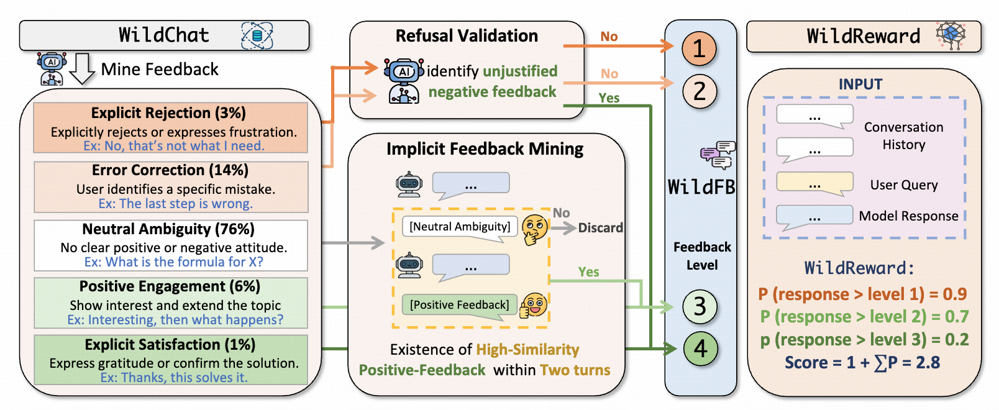
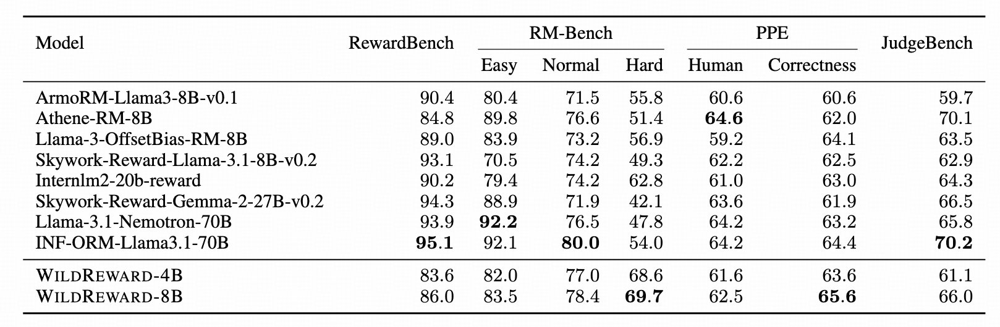
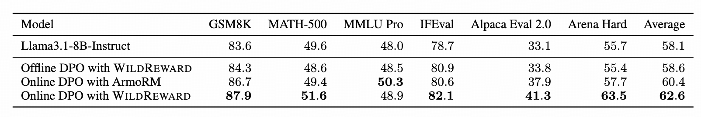
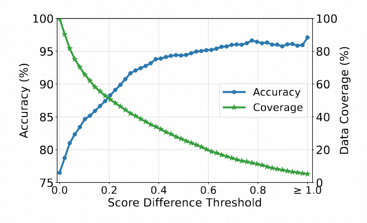

# 🦁 WildReward: Learning Reward Models from In-the-Wild Interactions

[](LICENSE)
[](https://huggingface.co/THU-KEG/WildFB)
[](https://huggingface.co/THU-KEG/WildReward-8B)

> **Can we develop reward models directly from in-the-wild interactions without human-annotated preference pairs?**

**WildReward** is a novel framework that explores the potential of training Reward Models (RMs) using large-scale, real-world human-LLM interactions (sourced from WildChat). By extracting implicit reward signals from user feedback, WildReward achieves state-of-the-art performance without relying on expensive, manually annotated preference pairs.

## 📖 Background & Motivation

Reward models are the cornerstone of aligning LLMs with human values (RLHF). Traditionally, training these models requires **large-scale human-annotated preference pairs**, which are:
1.  **Expensive** to collect.
2.  **Limited** in diversity.
3.  **Static** compared to evolving user needs.

However, with the widespread deployment of LLMs, we have access to abundant **in-the-wild interactions**. Users constantly provide feedback—explicitly or implicitly—through their follow-up queries (e.g., correcting a model's code, rejecting a refusal, or thanking the model).

**The Challenge:** Real-world feedback is **sparse** (mostly implicit) and **noisy** (e.g., unjustified negative feedback on safety refusals).
**The Solution:** WildReward proposes an automated pipeline to clean, classify, and leverage this data to train robust reward models.

## 🚀 Key Contributions

*   **🚫 No Preference Pairs Needed:** We train directly on user-chatbot interaction history via ordinal regression, eliminating the need for paired human annotations.
*   **💎 WildFB Dataset:** We introduce **WildFB**, a high-quality dataset of **186k instances** filtered and refined from WildChat, labeled with 5 levels of satisfaction.
*   **🔍 Advanced Filtering Pipeline:** We utilize a two-stage refinement strategy:
    *   **Implicit Feedback Mining:** Recovers hidden positive signals from neutral-looking contexts.
    *   **Refusal Validation:** Filters out noise where users unjustifiably penalize correct safety refusals.
*   **📈 Superior Calibration:** WildReward demonstrates better cross-sample consistency and calibration compared to conventional RMs.

## 🛠️ Methodology

We propose an automated pipeline to extract reliable human feedback from the WildChat dataset. The process involves classifying user feedback into five levels of satisfaction (Rejection, Error Correction, Neutral Ambiguity, Positive Engagement, Satisfaction) and applying rigorous filtering to remove noise.



## 📊 Performance & Results

Extensive experiments demonstrate that WildReward is highly effective:

### Standard Reward Model Benchmarks

WildReward achieves comparable or superior performance to conventional reward models on **RewardBench**, **RM-Bench**, **PPE**, and **JudgeBench**, despite being trained solely on in-the-wild interactions without any human-annotated preference pairs.



### Online DPO Application

When applied to Online DPO (Direct Preference Optimization), WildReward significantly boosts policy performance across multiple domains:

*   **Mathematical Reasoning:** Improved problem-solving capabilities
*   **Instruction Following:** Better adherence to user constraints
*   **Creative Writing:** Enhanced coherence and creativity



### Model Calibration

WildReward demonstrates superior calibration properties compared to conventional reward models:

*   **Strong Confidence-Accuracy Correlation:** Higher score margins reliably indicate higher prediction accuracy
*   **Cross-Sample Consistency:** Provides unified and meaningful scores that enable reliable quality assessment across different contexts and samples

<p align="center">
  
</p>


## 📂 Data & Models

*   **WildFB Dataset:** https://huggingface.co/THU-KEG/WildFB
*   **WildReward Models:** https://huggingface.co/THU-KEG/WildReward-8B

## Project Structure

```
WildReward/
├── collect_rm_data/     # Data collection pipeline (8-step workflow)
├── train_rm/           # Reward model training with ordinal regression
├── deploy_rm/          # Distributed reward model serving
└── online_dpo/         # Core Online DPO training framework (based on VERL)
```

## Installation

```bash
# Install core dependencies
cd online_dpo
pip install -e .

# Install data collection dependencies
cd ../collect_rm_data
pip install -r requirements.txt
```

## Usage

### 1. Collect Data

The data collection pipeline processes WildChat data to generate labeled preference pairs:

```bash
cd collect_rm_data
./run_pipeline.sh
```

The pipeline consists of 8 steps:
- **Step 00**: Preprocess WildChat parquet files to JSONL format
- **Step 01**: Generate preference classification prompts
- **Step 02**: Generate responses using LLM API
- **Step 03**: Filter and parse outputs
- **Step 04**: Merge conversations
- **Step 05**: Hindsight mining with topic-aware feedback
- **Step 06**: Refusal validation
- **Step 08**: Train/test split (5000 samples for test)

Output: Labeled data with ordinal ratings (1-4) for reward model training.

### 2. Train Reward Model

Train an ordinal reward model using the collected data:

```bash
cd train_rm
# Tokenize the data
python tokenize_data.py --input_path ../collect_rm_data/output/final_data.jsonl

# Train the reward model with DeepSpeed
deepspeed --num_gpus 8 train_rm.py \
  --model_path meta-llama/Meta-Llama-3-8B \
  --data_path data/tokenized \
  --output_dir ./output/checkpoints
```

The reward model uses ordinal regression (CORAL-like approach) converting discrete labels (1-4) to 3 binary targets.

### 3. Deploy Reward Model

Deploy the trained reward model as a distributed API service:

```bash
cd deploy_rm
./deploy.sh
```

The deployment architecture includes:
- **Router**: Round-robin load balancer on port 9000
- **Workers**: Multiple worker processes on dedicated GPUs (ports 8004-8007)
- **Features**: FP16 inference, batch processing, automatic failover

### 4. Online DPO Training

Train your language model using Online DPO with the deployed reward model:

```bash
cd online_dpo

# Configure your reward model API endpoint
export REWARD_MODEL_ENDPOINT="http://localhost:9000/score"

# Run training
./examples/online_dpo_trainer/run_llama3_8b.sh
```

Key training features:
- **Remote Reward Scoring**: Integrates with deployed reward model via HTTP API
- **Distributed Training**: Multi-GPU support with DeepSpeed and Ray
- **Hydra Configuration**: Flexible parameter management
- **Stable Optimization**: Direct preference objective prevents reward hacking


## Documentation

- [Online DPO Framework](./online_dpo/README.md) - Core framework documentation
- [Data Collection Pipeline](./collect_rm_data/README.md) - Detailed pipeline guide
- [Reward Model Training](./train_rm/README.md) - Training instructions
- [Deployment Guide](./deploy_rm/README.md) - Serving and deployment

## Citation

```bibtex
```

## License

This project is licensed under the Apache License 2.0 - see the [LICENSE](LICENSE) file for details.

## Acknowledgments

This project is built upon the VERL (Volcano Engine Reinforcement Learning for LLMs) framework and uses the WildChat dataset for reward model training.
